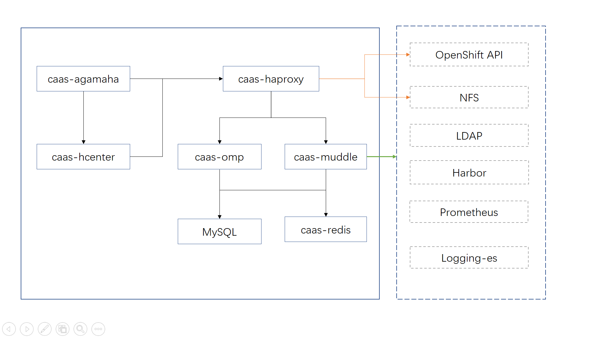

# CaaSPortal

## CaaSPortal

## 简介

## 功能模块

```text
caas-agamaha: 最外层负载，负载前端hcenter和后端caas-haproxy
caas-hcenter：前端程序，处理用户请求
caas-haproxy：后端haproxy，负载后端caas-muddle，NFS，OpenShift和caas-omp
caas-muddle：后端java程序，主要提供用户容器相关操作接口
caas-omp：后端java程序，主要提供用户相关管理的接口
caas-redis： 数据缓存
MySQL：数据持久化存储
```

除MySQL外，其他组件均为容器部署，容器环境变量信息如下

| 组件 | 变量名 | 变量值（//备注\) |
| --- | --- | --- |
| caas-agamaha | HCENTER\_SERVER | caas-hcenter |
|  | HCENTER\_PORT | 8080 |
|  | WEB\_SERVER | caas-haproxy |
|  | WEB\_PORT | 8888 |
| caas-hcenter | LANG | C.UTF-8 |
|  | EGG\_WORKERS | 1 |
|  | CAAS\_BACKEND | caas-haproxy |
|  | CAAS\_BACKEND\_PORT | 8888 |
|  | LOGO | sextant |
| caas-haproxy | WEB\_SERVER | caas-muddle |
|  | WEB\_PORT | 8080 |
|  | NFS\_URL | 10.74.248.252 |
|  | NFS\_PORT | 8080 |
|  | OS\_BJ\_URL | os-console.caas.example.com |
|  | LANG | C.UTF-8 |
|  | OMP\_SERVER | caas-omp |
|  | OMP\_PORT | 8081 |
| caas-muddle | PATH | /usr/local/sbin:/usr/local/bin:/usr/sbin:/usr/bin:/sbin:/bin |
|  | APPS\_HOME | /AppServer |
|  | TZ | Asia/Shanghai |
|  | JAVA\_HOME | /usr/lib/jvm/java-8-openjdk-amd64 |
|  | CA\_CERTIFICATES\_JAVA\_VERSION | 20140324 |
|  | JAVA\_OPTS | -Xmx2048m -Xms2048m |
|  | JAVA\_VERSION | 8u111 |
|  | LANG | C.UTF-8 |
|  | DB\_URL | jdbc:mysql://10.74.248.254:3306/hcpaas?characterEncoding=utf8&autoReconnect=true&allowMultiQueries=true |
|  | REDIS\_URL | caas-redis.caasportal.svc.cluster.local |
|  | REDIS\_PORT | 6379 |
|  | vol\_create\_sleep | 5000 |
|  | openshift\_terminal\_url | ws://portalapi.caas.example.com |
|  | hb\_info | YWRtaW46Q2FhczEyMzQ1   \(//harbor的admin:passwd的base64加密信息\) |
|  | JAVA\_DEBIAN\_VERSION | 8u111-b14-2~bpo8+1 |
|  | DB\_USERNAME |默认root |
|  | DB\_PWD | 默认adminpwd |
| caas-omp | PATH | /usr/local/sbin:/usr/local/bin:/usr/sbin:/usr/bin:/sbin:/bin |
|  | APPS\_HOME | /AppServer |
|  | TZ | Asia/Shanghai |
|  | JAVA\_HOME | /usr/lib/jvm/java-8-openjdk-amd64 |
|  | CA\_CERTIFICATES\_JAVA\_VERSION | 20140324 |
|  | JAVA\_OPTS | -Xmx2048m -Xms2048m |
|  | JAVA\_VERSION | 8u111 |
|  | LANG | C.UTF-8 |
|  | spring\_datasource\_druid\_bmp\_url | jdbc:mysql://10.74.248.254:3306/hcpaas\_bmp?characterEncoding=utf8&autoReconnect=true&allowMultiQueries=true&serverTimezone=Asia/Shanghai |
|  | spring\_datasource\_druid\_portal\_url | jdbc:mysql://10.74.248.254:3306/hcpaas?characterEncoding=utf8&autoReconnect=true&allowMultiQueries=true&serverTimezone=Asia/Shanghai |
|  | spring\_redis\_host | caas-redis |
|  | spring\_redis\_port | 6379 |
|  | spirit\_caasUrl | [http://caas-haproxy:8888](http://caas-haproxy:8888) |
|  | JAVA\_DEBIAN\_VERSION | 8u111-b14-2~bpo8+1 |

各个组件之间关系如下,右侧虚线框中为其他组件 

## 备注

服务无法正常访问

排查步骤

1. 检查客户端网络连接是否正常
2. 域名解析是否正确
3. 检查caas-agamaha：环境变量是否正确，caas-agamaha是否能跟caas-hcenter和caas-haproxy正常通信
4. 检查caas-hcenter是否启动正常，环境变量是否正确，能否跟caas-haproxy正常通信
5. 检查caas-haproxy是否启动正常，环境变量是否正确，能否跟caas-muddle，NFS，OpenShift和caas-omp服务器正常通信
6. 检查caas-muddle是否启动正常，环境变量是否正确，查看日志中是否有报错
7. 检查caas-omp是否启动正常，环境变量是否正确，查看日志中是否正常
8. 检查caas-redis是否启动正常
9. 检查mysql是否正常提供服务

用已创建命名空间的用户登录仍然提示输入命名空间 排查步骤

1. 检查caas-haproxy中关于caas-muddle的环境变量是否设置正确
2. 检查caas-muddle是否能正常提供服务

