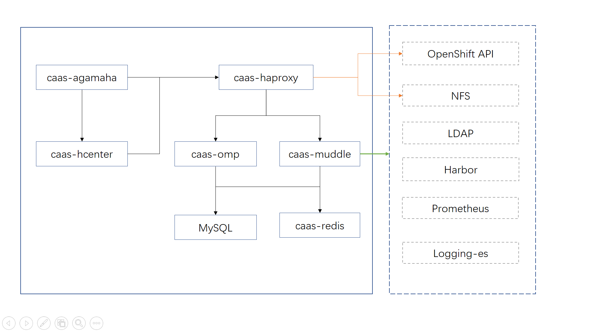

# CaaSPortal
# 简介 #

# 功能模块 #

	caas-agamaha: 最外层负载，负载前端hcenter和后端haproxy-haproxy
	caas-hcenter：前端程序，处理用户请求
	caas-haproxy：后端haproyx，负载后端caas-muddle，NFS，OpenShift和caas-omp
	caas-muddle：后端java程序，主要提供用户容器相关操作接口
	caas-omp：后盾java程序，主要提供用户相关管理的接口
	caas-redis： 数据缓存
	MySQL：数据持久化存储

除MySQL外，其他组件均为容器部署，容器环境变量信息如下

各个组件之间关系如下,右侧虚线框中为其他组件

# 备注 #
服务无法正常访问

排查步骤

1. 检查客户端网络连接是否正常
2. 域名解析是否正确
3. 检查caas-agamaha：环境变量是否正确，caas-agamaha是否能跟caas-hcenter和caas-haproxy正常通信
4. 检查caas-hcenter是否启动正常，环境变量是否正确，能否跟caas-haproxy正常通信
5. 检查caas-haproxy是否启动正常，环境变量是否正确，能否跟环境变量中的caas-muddle，NFS，OpenShift和caas-omp服务器正常通信
6. 检查caas-muddle是否启动正常，环境变量是否正确，查看日志中是否有报错
7. 检查caas-omp是否启动正常，环境变量是否正确，查看日志中是否正常
8. 检查caas-redis是否启动正常
9. 检查mysql是否正常提供服务

用已创建命名空间的用户登录仍然提示输入命名空间
排查步骤

1. 检查caas-haproxy中关于caas-muddle的环境变量是否设置正确
2. 检查caas-muddle是否能正常提供服务

