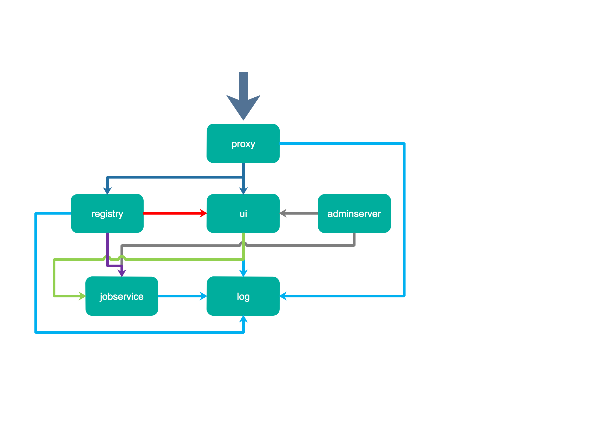
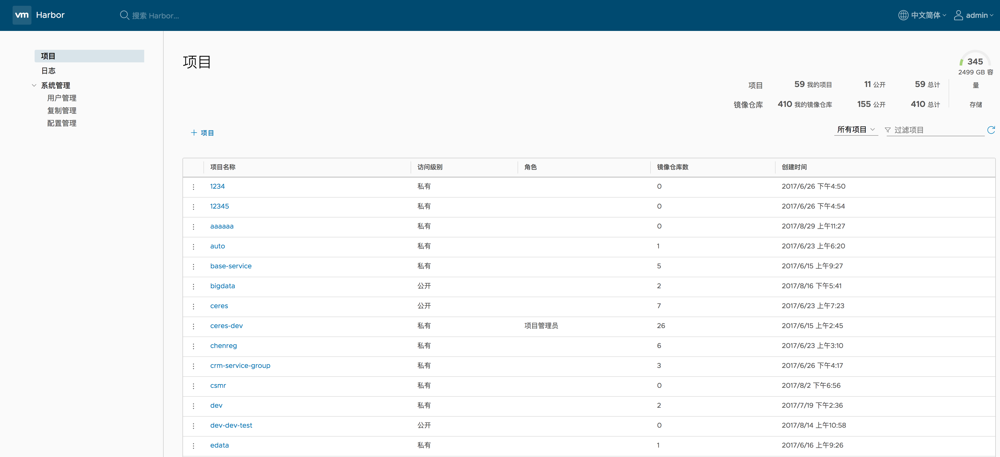
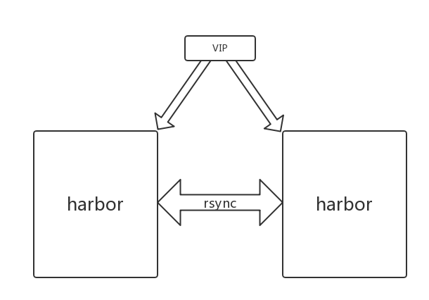

# Harbor

## Harbor介绍

VMware公司开源的企业级Registry项目[Harbor](https://github.com/vmware/harbor)，其的目标是帮助用户迅速搭建一个企业级的Docker registry 服务。它以Docker公司开源的registry 为基础，提供了管理UI, 基于角色的访问控制\(Role Based Access Control\)，AD/LDAP集成、以及审计日志\(Audit logging\) 等企业用户需求的功能。

## Harbor架构



主要组件包括：

1. proxy，他是一个nginx前端代理，主要是分发前端页面ui访问和镜像上传和下载流量，上图中通过深蓝色先标识；
2. ui提供了一个web管理页面，当然还包括了一个前端页面和后端API，底层使用mysql数据库；
3. registry是镜像仓库，负责存储镜像文件，当镜像上传完毕后通过hook通知ui创建repository，上图通过红色线标识，当然registry的token认证也是通过ui组件完成；
4. adminserver是系统的配置管理中心附带检查存储用量，ui和jobserver启动时候会需要加载adminserver的配置，上图中通过灰色线标识；
5. jobsevice是负责镜像复制工作的，他和registry通信，从一个registry pull镜像然后push到另一个registry，并记录job\_log，上图中通过紫色线标识；
6. log是日志汇总组件，通过docker的log-driver把日志汇总到一起，上图中通过浅蓝色线条标识。 

## Harbor使用

当前部署的是基于harbor 1.4定制开发的版本。



### 1.用户管理

基于角色的访问控制，即RBAC，将用户分为三种角色：项目管理员（MDRWS）、开发人员（RWS）和访客（RS）。此外，还有一个最高管理员权限，即admin系统管理员。   
上面括号中的内容即为角色所具有的权限，包括 M:管理、D:删除、R:读取、W:写入、S:查询，非常细致的权限管理体系。当然一个用户可以在不同的项目里面扮演不同角色，这个和现实的用户管理体系非常吻合。

### 2.项目管理

项目管理是系统最主要的一个功能模块。项目是一组镜像仓库的逻辑集合，是权限管理和资源管理的单元划分。一个项目下面有多个镜像仓库，并且关联多个不同角色的成员。镜像复制也是基于项目的，通过添加复制规则，可以将项目下面的镜像从一个harbor迁移到另一个harbor，并且可以通过日志查看复制过程，并有retry机制。

### 3.配置管理和日志查询

配置管理主要是配置harbor的认证模式，用于企业内部使用，通常都是对接到公司LDAP上面，当然harbor也支持数据库认证；还可以设置token的有效时间。

用户对镜像的pull和push操作都可以被harbor记录下来，这样为排查文件提供了重要手段，在登录harbor的web UI后，可以在logs页面栏里查看相关的记录。   


## CaaS中Harbor部署方案



当前CaaS中harbor提供主备模式的高可用部署，在存储机A、B分别中部署一套harbor，使用rsync在从节点同步主节点数据，上面通过keepalived提供的vip保证服务的高可用。

### harbor与其他组件关系

harbor目前依赖:

1. ldap服务用于用户登录（认证与鉴权）;
2. 依赖CaaS webportal将push到harbor的镜像的元数据传回到CaaS，以及将镜像漏洞扫描结果传回到CaaS。

### harbor日志

虽然harbor各个组件都是使用docker容器部署，但是harbor所有组件的日志通过syslog存放到宿主机目录/var/log/harbor/下。

### harbor数据

harbor的数据默认存放到/caas\_data/harbor\_data/目录下，其中包括mysql数据，docker镜像数据以及postgresql数据\(镜像扫描需要的数据库\)。

rsync会定时（默认1小时，如果对harbor操作频繁可以手动修改从节点的/etc/crontab的同步周期）同步/caas\_data/harbor\_data/目录。

### 主从切换

如果主节点down掉，harbor vip会自动漂移到从节点，同时keepalived通知脚本也会自动重启harbor组件的mysql和postgresql\(此配置在从节点/etc/keepalived/keepalived.conf中\)。因此可以无感知地启用从节点的harbor提供服务。

如果主节点修复成功，想继续使用主节点提供服务的话，需要人工干预。在down掉的主节点上，首先确保keepalived服务停止，确保VIP不在主节点上；其次，在备机上启动rsyncd服务\(systemctl start rsyncd\)，之后查看主节点上/etc/crontab中的注释掉的rsync命令，手动运行以从从节点同步最新harbor数据；同步完成后，使用如下命令重启主节点harbor服务；之后启动keepalived确保VIP漂回主节点。

```bash
docker-compose -f /opt/harbor/docker-compose.yml \
    -f /opt/harbor/docker-compose.clair.yml down
docker-compose -f /opt/harbor/docker-compose.yml \
    -f /opt/harbor/docker-compose.clair.yml up -d
```

**注意：** 为了保证服务的稳定和可控，服务于harbor的keepalived服务在配置文件中定了主备关系，而不是非抢占式的双备启动，因此当down掉的主节点在恢复后，需要确保VIP能回漂到主节点。


