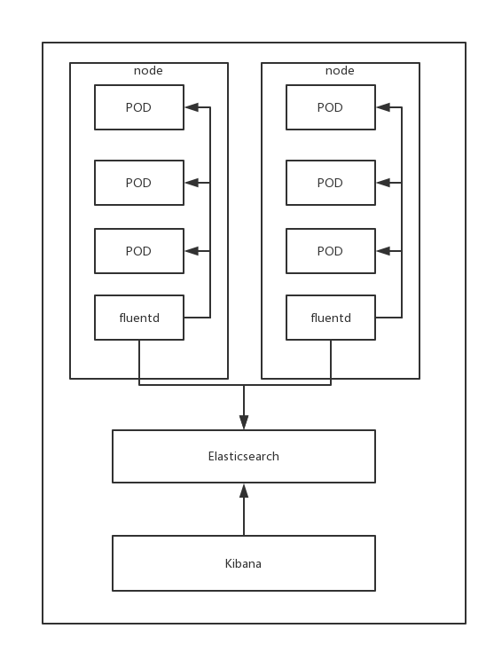
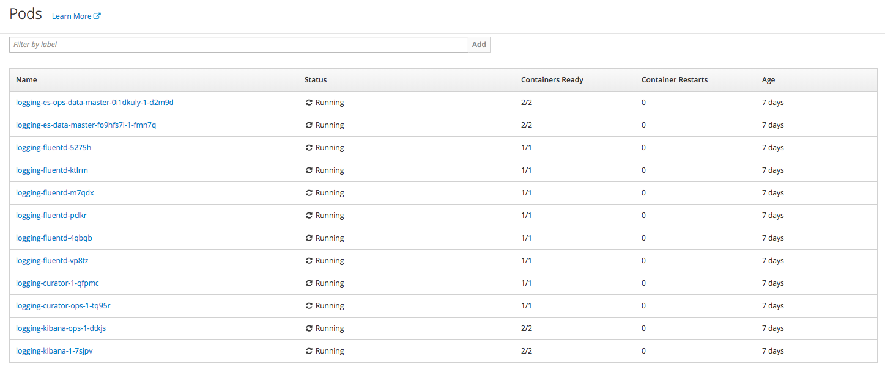
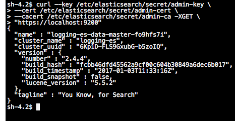

# Logging

在openshift集群下配置elasticsearch、fluentd、kibana集中收集openshift集群日志信息。

### 架构图



## 日志采集

OpenShift日志管理采用：

EFK方案：

1. Elasticsearch
2. Fluentd
3. Kibana

**Fluentd:** 读取宿主机上的/var/log/message和/var/lib/docker目录下的系统及日志信息，并格式化为json信息 。fluentd采用daemon set方式部署，通过在每一个node部署一个fluentd实例来采集日志并根据配置文件将采集日志内容过滤后输出到目标地址（elasticsearch）

**Elasticsearch:** Elasticsearch是个开源分布式搜索引擎，提供搜集、分析、存储数据三大功能。它的特点有：分布式，零配置，自动发现，索引自动分片，索引副本机制，restful风格接口，多数据源，自动搜索负载等。

**Kibana：** 一个开源和免费的工具，Kibana可以为 Fluent 和 ElasticSearch 提供的日志分析友好的 Web 界面，可以帮助汇总、分析和搜索重要数据日志。

**Curator：** 数据清理器，清理Elasticsearch中过期的数据。

**AuthProxy：** 身份验证，实现web console单点登录

## 容器平台相关调用

容器平台的日志管理模块使用了OpenShift的EFK日志采集方案。选择容器日志标签，根据格式 “命名空间-应用-服务-具体实例” 可以查看具体某个容器的应用日志（控制台打印的标准输出内容）。同时日志也将保存到elasticsearch集群中作持久化存储，以便于出现某种严重问题时，用户可以通过调用elasticsearch API获取容器日志。

日志管理模块可以选择相应日期和关键字作为日志筛选条件。通过定义日期以及关键字，用户可以更快更细致定位所需日志内容。同时，日志管理模块允许用户下载所筛选日志存储到本地，便于分析问题，保留日志内容。

## 运维及调试

EFK日志系统均通过容器方式部署，且部署在openshift-logging命名空间下。运维及相关调试均在OpenShift平台进行。日志平台部署完成后如下图，可以看到成功部署后应该有es（elasticsearch）/fluentd/kibana/curator服务。同时es/kibana服务中集成了authproxy服务（OpenShift平台认证服务）。

EFK的配置文件通过configmap方式挂载到各个服务实例配置目录下，通过查看logging命名空间下的configmap对象可以查看各个服务配置文件。部分配置文件体现在服务deployments yaml中的env中，通过修改变量值即修改配置。修改deployment后选择deploy可部署新配置的服务实例。若修改configmap中各个服务配置，则需要重新部署相应的服务来获取更新后的配置。



### fluentd

Fluentd服务部署完成后，实例个数取决于集群的节点个数。每一个管理节点及计算节点均有一个fluentd实例。验证服务部署健康状态检查：

1. 查看fluentd日志

   ```yaml
   2016-02-19 20:40:44 +0000 [info]: reading config file path="/etc/fluent/fluent.conf"
   ```

2. 进入elasticsearch容器实例执行如下命令查看是否有数据生成。通过OpenShift web console进入elasticsearch（logging-es-data-&lt;suffix&gt;）容器实例或使用本地终端客户端（xshell/iterm）在登录OpenShift平台后使用命令"oc rsh logging-es-data-\*"进入容器实例，然后运行如下命令

   ```bash
   curl --key /etc/elasticsearch/secret/admin-key \
   --cert /etc/elasticsearch/secret/admin-cert \
   --cacert /etc/elasticsearch/secret/admin-ca -XGET \
   "https://localhost:9200/_cat/indices?v"
   ```

调整fluentd运行参数及其他配置需修改fluentd配置文件。登录OpenShift webconsole进入logging命名空间下选择resources--&gt;other resources--&gt;daemon set可以看到fluentd对象实例。通过actions中的edit yaml来编辑fluentd的daemon set对象。

### elasticsearch

elasticsearch服务提供了日志服务的存储和检索。分为两类，一是负责容器日志的es实例（集群），二是负责系统日志的es实例（集群）。生产环境建议使用es集群模式，可以保障数据安全性以及高可用。es数据存储不支持nfs持久化卷方式。因此采用本机hostpath方式挂载。建议日志存储设备采用ssd或其他高性能存储设备（磁盘io压力大）。根据pod名称可以区分es实例存储用途。logging-es-data-&lt;suffix&gt;为容器日志es实例，logging-es-ops-data-&lt;suffix&gt;为系统日志es实例。集群模式时，实例个数等于集群配置个数。

1. 监控检查：
   * 容器启动后，检查实例日志，无报错即可
   * 进入容器终端，执行如下命令查看es监控状态

     ```bash
     curl --key /etc/elasticsearch/secret/admin-key \
     --cert /etc/elasticsearch/secret/admin-cert \
     --cacert /etc/elasticsearch/secret/admin-ca -XGET \
     "https://localhost:9200"
     ```

     返回如下图即可

     
2. 运维操作及排查错误
   * 查看容器日志有无异常报错，通常当一个节点数据过多可能会引起es实例超负载而引起容器无休止重启。解决办法通过调整heap size或者使用es集群模式。如无法修复此问题，可通过es实例启动恢复数据时调用api来删除相应日志。通过webconsole或cli删除logging-es-data-&lt;suffix&gt;实例重启，查看重新生成pod的日志信息。es服务启动后（日志中会提示started以及服务端口为9200时表明服务启动）再调用删除接口。heap size调整方式通过设定ENV INSTANCE\_RAM的值进行调整。使用如下命令删除部分日志

     ```bash
     curl --key /etc/elasticsearch/secret/admin-key \
     --cert /etc/elasticsearch/secret/admin-cert \
     --cacert /etc/elasticsearch/secret/admin-ca -XDELETE \
     "https://localhost:9200/project.{PROJECT_NAME}.{PROJECT_ID}.{DATE}"
     ```

     {PROJECT\_NAME}:命名空间名称，可用"\*"代替，代表所有namespace

     {PROJECT\_ID}:命名空间ID，如不清楚如何查询namespaceID，可通过"\*"代替

     {DATE}:日志，格式形如"2018.04.01"

     通过选定项目名称、项目ID、日期进行有筛选的删除相应索引达到降低es实例负载

   * 组件curator部署后会定期删除旧时日志。因此集群发生问题可能性较小。
   * 重启es实例可以通过OpenShift web console或CLI删除相应pod即可重启服务。切记持久化卷已挂载到数据目录。
   * es实例（集群）部署方式为手动触发，即修改过deployments文件后需要在web console或CLI执行部署操作。

### kibana

kibana作为日志的展示模块，常常用于运维人员或拥有使用kibana技能的用户。kibana具有通过向es实例（集群）获取日志数据并进行展示、聚合、统计等功能。EFK日志系统部署完成后通过访问`https://kibana_url`来进行访问。同时该模块集成了OpenShift认证模块。因此使用kibana工具时，需要进行用户验证。用户名及密码等同于OpenShift平台用户。用户可以通过caas前端创建push构建查看到相应用户名及密码或向管理员询问相关信息。admin用户可以查看所用用户命名空间下所采集到的日志。普通用户只可查看个人命名空间下日志内容。

1. 服务监控检查
   * 服务部署完成后，通过访问`https://kibana_url`地址来进行对kibana的访问，输入正确的用户名密码可以看到如下图内容。
   * kibana pod中包含两个容器，一个是kibana-proxy，作为用户权限认证。另一个为kibana自身服务。kibana-proxy若打印如下日志将表明服务启动正常。

     ```bash
     Starting up the proxy with auth mode "oauth2" and proxy transform "user_header,token_header".
     ```

     kibana服务若成功与es实例（集群）通信并且获得es数据将打印如下日志

     ```bash
     {"type":"log","@timestamp":"2016-09-07T20:07:31+00:00","tags":["listening","info"],"pid":8,"message":"Server running at http://0.0.0.0:5601"}
     {"type":"log","@timestamp":"2016-09-07T20:07:31+00:00","tags":["status","plugin:elasticsearch","info"],"pid":8,"name":"plugin:elasticsearch","state":"green","message":"Status changed from yellow to green - Kibana index ready","prevState":"yellow","prevMsg":"Waiting for Elasticsearch"}
     ```
2. 使用

   同kibana使用方式，索引名为"project.{project\_name}.{project\_id}.{date}"。

3. 运维及排查错误
   * kibana访问显示503错误

     首先确保kibana pod中kibana-proxy以及kibana服务本身运行正常。通过如下命令查看service中是否存在kibana的endpoints

     ```bash
     $ oc describe service logging-kibana
     Name:                   logging-kibana
     [...]
     Endpoints:              <none>
     ```

     如果kibana pod存活正常，那么将会有endpoints列出。如果没有，请查看kibana相关部署文档进行重新部署。

     其次我们应该确保访问的kibana地址正确性。地址通过如下命令可以查看

     ```bash
     $ oc get route  --all-namespaces --selector logging-infra=support
     NAMESPACE   NAME         HOST/PORT                 PATH      SERVICE
     logging     kibana       kibana.example.com                  logging-kibana
     logging     kibana-ops   kibana-ops.example.com              logging-kibana-ops
     ```

     若依然无法访问，请查看route具体后端service是否为正确。且service代理后端为正在运行的kibana pod服务

   * kibana登录认证失败

     若登录kibana服务时，登录地址会重定向到相对应OpenShift平台，登录成功后会重定向会kibana访问地址。若输入正确用户名密码后依然提示需要登录，问题可能发生在secret不匹配，遗憾并没有办法或者某种方式可以得到这样的信息。操作如下命令后重新部署logging-EFK日志系统

     ```bash
     $ oc delete oauthclient/kibana-proxy
     ```

