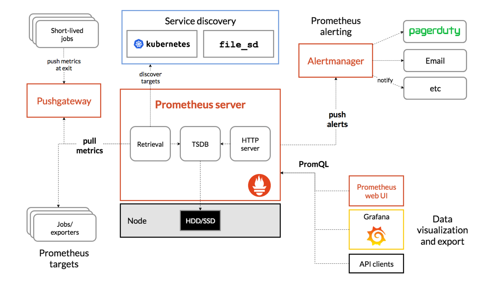
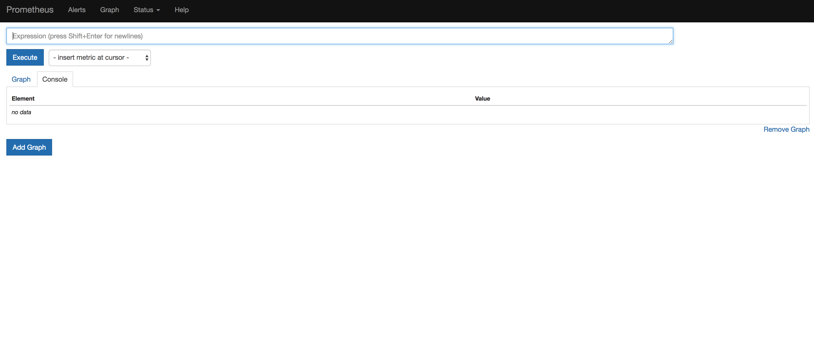
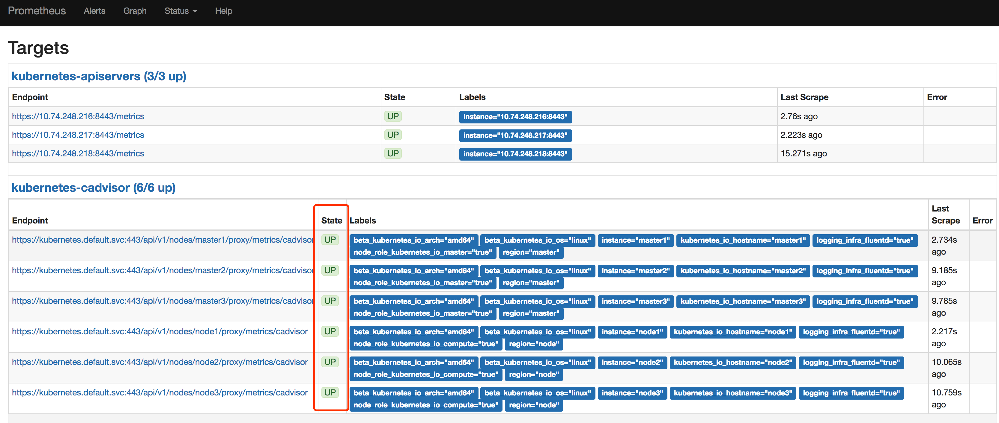
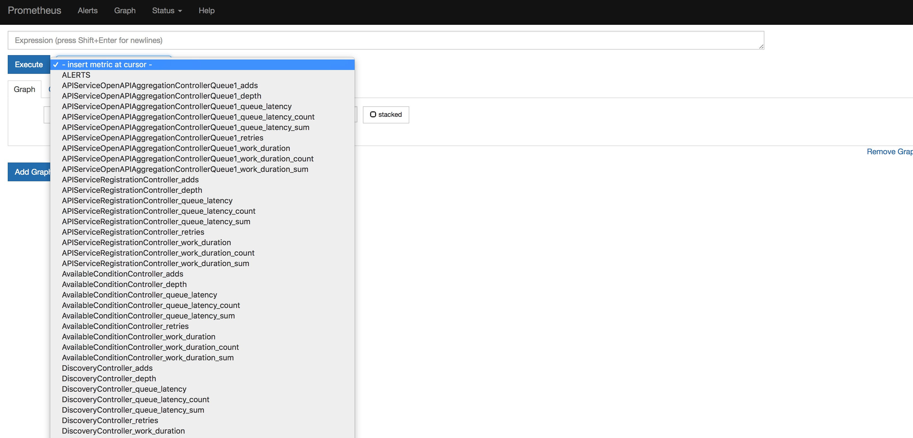
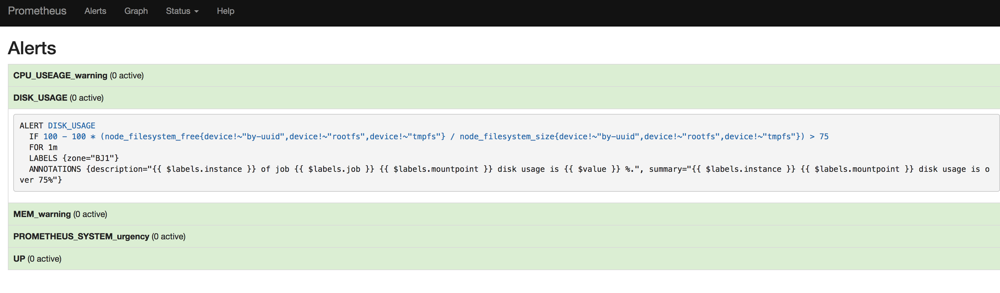

# Monitor

## prometheus架构及基本概念

### 架构图




#### 基本架构

Prometheus生态包括了很多组件，它们中的一些是可选的：

- 主服务Prometheus Server负责抓取和存储时间序列数据
- 客户库负责检测应用程序代码
- 支持短生命周期的PUSH网关
- 基于Rails/SQL仪表盘构建器的GUI
- 多种导出工具，可以支持Prometheus存储数据转化为HAProxy、StatsD、Graphite等工具所需要的数据存储格式
- 警告管理器
- 命令行查询工具
- 其他各种支撑工具
- 多数Prometheus组件是Go语言写的，这使得这些组件很容易编译和部署。

#### 特征

Prometheus的主要特征有：

- 多维度数据模型
- 灵活的查询语言
- 不依赖分布式存储，单个服务器节点是自主的
- 以HTTP方式，通过pull模型拉去时间序列数据
- 也通过中间网关支持push模型
- 通过服务发现或者静态配置，来发现目标服务对象
- 支持多种多样的图表和界面展示，grafana也支持它

## 容器平台应用

1. 容器平台中的监控模块采用prometheus server作为监控主体，报警模块采用alertmanager作为主体。grafana作为运维使用监控openshift集群及集群主机展示主体
2. 容器平台提供容器CPU、内存、网络io监控数据、卷使用剩余量。
3. 监控模块中可以通过预警菜单创建预警信息。通过设定不同监控项报警阈值实现通过邮件或短信方式（需提供相应接口）

## prometheus server服务部署健康检查

访问prometheus地址，能够正常显示下图界面且prometheus命名空间下该容器日志未报异常即可



## prometheus监控客户端健康检查

访问http://prometheus_url/targets，配置项中的client信息都将在这里展示。state状态（红框部分）为up表明prometheus server可以从该地址提供的api拉取数据。



## promdash使用说明

1. 菜单栏分为五个标签

   -  prometheus：选择该标签进入dashboard首页，可以生成简易图表，通过选择“insert metric at cursor”可以选择prometheus server所采集的所有指标，通过promQL可以组合成你想要的数据

     

   - alerts：容器平台生成的报警规则及后台自行创建的报警规则都会在这里展示

     

   - graph：同prometheus菜单

   - status：状态菜单分四个5个子菜单。

     - runtime & build information：运行状态及构建信息
     - Conmmand-line：prometheus启动运行参数
     - configuration：prometheus配置文件
     - rules：设定的报警规则
     - Targets：客户端状态及元数据

   - help：跳转至官方网站

## 配置项说明

prometheus server配置文件目录地址为openshift-prometheus-configmap下的prometheus-config。通过修改该configmap即修改prometheus server配置。Prometheus可以通过命令行参数和配置文件来配置它的服务参数。命令行主要用于配置系统参数（例如：存储位置，保留在磁盘和内存中的数据量大小等），配置文件主要用于配置与抓取任务和任务下的实例相关的所有内容, 并且加载指定的抓取规则file。可以通过运行prometheus -h命令, 查看Prometheus服务所有可用的命令行参数，Prometheus服务可以reload它的配置。如果这个配置错误，则更改后的配置不生效。配置reolad是通过给Prometheus服务发送信号量SIGHUP或者通过http发送一个post请求到/-/reload。这也会重载所有配置的规则文件(rule files)。这个配置文件是[YAML](http://en.wikipedia.org/wiki/YAML)格式， 通过下面描述的范式定义, 括号表示参数是可选的。对于非列表参数，这个值被设置了默认值。

通用占位符由下面定义：

- `\<boolean\>`: 一个布尔值，包括`true`或者`false`.
- `\<duration\>`: 持续时间，与正则表达式`[0-9]+(ms|smhdwy)`匹配
- `\<labelname\>`: 一个与正则表达式`[a-zA-Z_][a-zA-Z0-9_]*`匹配的字符串
- `\<labelvalue\>`: 一个为unicode字符串
- `\<filename\>`: 当前工作目录下的有效路径
- `\<host\>`: 一个包含主机名或者IP地址，并且可以带上一个非必需的端口号的有效字符串
- `\<path\>`: 一个有效的URL路径
- `\<scheme\>`: 一个可以是`http`或者`https`的字符串
- `\<string\>`: 一个正则表达式字符串

全局配置指定的参数，在其他上下文配置中是生效的。这也默认这些全局参数在其他配置区域有效。

示例配置文件：

```yaml
global:
  scrape_interval: 10s
  scrape_timeout: 10s
rule_files:
  - "/rules/*.rules"
scrape_configs:
- job_name: 'kubernetes-apiservers'
  kubernetes_sd_configs:
  - role: endpoints
  scheme: https
  tls_config:
    ca_file: /var/run/secrets/kubernetes.io/serviceaccount/ca.crt
  bearer_token_file: /var/run/secrets/kubernetes.io/serviceaccount/token
  relabel_configs:
  - source_labels: [__meta_kubernetes_namespace, __meta_kubernetes_service_name, __meta_kubernetes_endpoint_port_name]
    action: keep
    regex: default;kubernetes;https


- job_name: 'kubernetes-nodes'
  scheme: https
  tls_config:
    ca_file: /var/run/secrets/kubernetes.io/serviceaccount/ca.crt
  bearer_token_file: /var/run/secrets/kubernetes.io/serviceaccount/token

  kubernetes_sd_configs:
  - role: node
  relabel_configs:
  - action: labelmap
    regex: __meta_kubernetes_node_label_(.+)
  scheme: https


- job_name: 'kubernetes-services'
  metrics_path: /probe
  params:
    module: [http_2xx]
  kubernetes_sd_configs:
  - role: service
  relabel_configs:
  - source_labels: [__meta_kubernetes_namespace, __meta_kubernetes_service_name]
    regex: (.+);(.+)
    action: replace
    replacement: $1/$2
    target_label: job    

  - source_labels: [__meta_kubernetes_service_label_metrics]
    action: keep
    regex: have

- job_name: 'kubernetes-pods'
  kubernetes_sd_configs:
  - role: pod
  relabel_configs:

  - action: labelmap
    regex: __meta_kubernetes_pod_label_(.+)
  - source_labels: [__meta_kubernetes_namespace]
    action: replace
    target_label: kubernetes_namespace

  - source_labels: [__meta_kubernetes_pod_label_metrics]
    action: keep
    regex: have


- job_name: prometheus
  static_configs:
    - targets: ['localhost:9090']

- job_name: 'kubernetes-cadvisor'
  kubernetes_sd_configs:
  - role: node
  scheme: https
  tls_config:
    ca_file: /var/run/secrets/kubernetes.io/serviceaccount/ca.crt
  bearer_token_file: /var/run/secrets/kubernetes.io/serviceaccount/token
  relabel_configs:
  - action: labelmap
    regex: __meta_kubernetes_node_label_(.+)
  - target_label: __address__
    replacement: kubernetes.default.svc:443
  - source_labels: [__meta_kubernetes_node_name]
    regex: (.+)
    target_label: __metrics_path__
    replacement: /api/v1/nodes/${1}/proxy/metrics/cadvisor

- job_name: linux
  static_configs:
    - targets: ['10.74.248.217:9100']
      labels:
        alias: master2
    - targets: ['10.74.248.218:9100']
      labels:
        alias: master3
    - targets: ['10.74.248.216:9100']
      labels:
        alias: master1
    - targets: ['10.74.248.237:9100']
      labels:
        alias: lb2
    - targets: ['10.74.248.236:9100']
      labels:
        alias: lb1
    - targets: ['10.74.248.238:9100']
      labels:
        alias: storage1
    - targets: ['10.74.248.239:9100']
      labels:
        alias: storage2
    - targets: ['10.74.248.219:9100']
      labels:
        alias: node1
    - targets: ['10.74.248.220:9100']
      labels:
        alias: node2
    - targets: ['10.74.248.235:9100']
      labels:
        alias: node3

```

1. 配置文件全局

```yaml
global:
    # 抓取目标实例的频率时间值，默认10s
    [ scrape_interval: <duration> | default = 10s ]

    # 一次抓取请求超时时间值，默认10s
    [ scrape_timeout: <duration> | default = 10s ]

    # 执行配置文件规则的频率时间值, 默认1m
    [ evaluation_interval: <duration> | default=1m ]

    # 当和外部系统通信时(federation, remote storage, Alertmanager), 这些标签会增加到度量指标数据中
    external_labels:
        [ <labelname>: <labelvalue> ... ]

# 规则文件指定规则文件路径列表。规则和警报是从所有匹配的文件中读取的
rule_files:
    [ - <filepath_glob> ...]

# 抓取配置的列表
scrape_configs:
    [ - <scrape_config> ... ]   

# 警报设置
alerting:
    alert_relabel_configs:
    [  - <relabel_config> ... ]
    alertmanagers:
    [ - <alertmanager_config> ... ]
```

2. scrape_config中配置详解

```yaml
# 默认下任务名称赋值给要抓取的度量指标
job_name: <job_name>

# 从这个任务中抓取目标的频率时间值
[ scrape_interval: <duration> | default= <global_config.scrape_interval>]

# 当抓取这个任务的所有目标时，超时时间值
[ scrape_timeout: <duration> | default = <global_config.scrape_timeout> ]

# 从目标列表中抓取度量指标的http资源路径, 默认为/metrics
[ metrics_path: <path> | default = /metrics ]

# honor_labels controls how Prometheus handles conflicts between would labels that are already present in scraped data and labels that Prometheus would attach server-side ("job" and "instance" labels, manually configured target  labels, and labels generated by service discovery implementations).
# If honor_labels is set to "true", label conflicts are resolved by keeping label
# values from the scraped data and ignoring the conflicting server-side labe# ls. If honor_labels is set to "false", label conflicts are resolved by ren# amin conflicting labels in the scraped data to "exported_<original-label>" (for example "exported_instance", "exported_job") and then attaching server-side labels. This is useful for use cases such as federation, where all label#s specified in the target should be preserved. Note that any globally configured "external_labels" are unaffected by this
# setting. In communication with external systems, they are always applied 
# only when a time series does not have a given label yet and are ignored otherwise.
[ honor_labels: <boolean> | default = false ]

# 配置请求的协议范式, 默认为http请求
[ scheme: <scheme> | default = http ]

# 可选的http url参数
params:
    [ <string>:[<string>, ...]]

# 在`Authorization`头部设置每次抓取请求的用户名和密码
basic_auth:
[username: <string>]
[password: <string>]

# Sets the `Authorization` header on every scrape request with
# the configured bearer token. It is mutually exclusive with `bearer_token_file`.
[ bearer_token: <string> ]

# Sets the `Authorization` header on every scrape request with the bearer token read from the configured file. It is mutually exclusive with `bearer_token`.
[ bearer_token_file: /path/to/bearer/token/file ]

# 配置抓取请求的TLS设置
tls_config:
  [ <tls_config> ]

# 可选的代理URL
[ proxy_url: <string> ]

# 文件服务发现配置列表
file_sd_configs:
  [ - <file_sd_config> ... ]

# Kubernetes服务发现配置列表
kubernetes_sd_configs:
  [ - <kubernetes_sd_config> ... ]

# 静态配置目标列表
static_configs:
  [ - <static_config> ... ]

# 抓取之前的标签重构配置列表
relabel_configs:
  [ - <relabel_config> ... ]

# List of metric relabel configurations.
metric_relabel_configs:
  [ - <relabel_config> ... ]

# Per-scrape limit on number of scraped samples that will be accepted.
# If more than this number of samples are present after metric relabelling
# the entire scrape will be treated as failed. 0 means no limit.
[ sample_limit: <int> | default = 0 ]
```

4.kubernetes配置项详解

从Kubernetes's REST API上，Kubernets SD配置允许检索和获取目标，并且始终保持与集群状态同步。下面role类型中的任何一个都能在发现目标上配置：

1. 节点node：这个node角色发现带有地址的每一个集群节点一个目标，都指向Kublelet的HTTP端口。这个目标地址默认为Kubernetes节点对象的第一个现有地址，地址类型为NodeInernalIP, NodeExternalIP, NodeLegacyHostIP和NodeHostName。可用的meta标签：


- __meta_kubernetes_node_name: 节点对象的名称

- __meta_kubernetes_node_label_<labelname>: 节点对象的每个标签
- __meta_kubernetes_node_annotation_<annotationname>: 节点对象的每个注释 _meta_kubernetes_node_address<address_type>: 如果存在，每一个节点对象类型的第一个地址
- 另外，对于节点的instance标签，将会被设置成从API服务中获取的节点名称。

2. 服务service：对于每个服务每个服务端口，service角色发现一个目标。对于一个服务的黑盒监控是通常有用的。这个地址被设置成这个服务的Kubernetes DNS域名, 以及各自的服务端口。可用的meta标签：

- __meta_kubernetes_namespace: 服务对象的命名空间

- __meta_kubernetes_service_name: 服务对象的名称
- __meta_kubernetes_service_label_<labelname>: 服务对象的标签。
- __meta_kubernetes_service_annotation_<annotationname>: 服务对象的注释
- __meta_kubernetes_service_port_name: 目标服务端口的名称
- __meta_kubernetes_service_port_number: 目标服务端口的数量
- __meta_kubernetes_service_port_portocol: 目标服务端口的协议

3. pod：pod角色发现所有的pods，并暴露它们的容器作为目标。对于每一个容器的声明端口，单个目标被生成。 如果一个容器没有指定端口，每个容器的无端口目标都是通过relabeling手动添加端口而创建的。可用的meta标签：

- __meta_kubernetes_namespace: pod对象的命名空间

- __meta_kubernetes_pod_name: pod对象的名称
- __meta_kubernetes_pod_ip: pod对象的IP地址
- __meta_kubernetes_pod_label_<labelname>: pod对象的标签
- __meta_kubernetes_pod_annotation_<annotationname>: pod对象的注释
- __meta_kubernetes_pod_container_name: 目标地址的容器名称
- __meta_kubernetes_pod_container_port_name: 容器端口名称
- __meta_kubernetes_pod_container_port_number: 容器端口的数量
- __meta_kubernetes_pod_container_port_protocol: 容器端口的协议
- __meta_kubernetes_pod_ready: 设置pod ready状态为true或者false
- __meta_kubernetes_pod_node_name: pod调度的node名称
- __meta_kubernetes_pod_host_ip: 节点对象的主机IP

4. endpoints端点：endpoints角色发现来自于一个服务的列表端点目标。对于每一个终端地址，一个目标被一个port发现。如果这个终端被写入到pod中，这个节点的所有其他容器端口，未绑定到端点的端口，也会被目标发现。可用的meta标签：

- __meta_kubernetes_namespace: 端点对象的命名空间
- __meta_kubernetes_endpoints_name: 端点对象的名称
- 对于直接从端点列表中获取的所有目标，下面的标签将会被附加上。
- __meta_kubernetes_endpoint_ready: endpoint ready状态设置为true或者false。
- __meta_kubernetes_endpoint_port_name: 端点的端口名称
- __meta_kubernetes_endpoint_port_protocol: 端点的端口协议

- 如果端点属于一个服务，这个角色的所有标签：服务发现被附加上。
- 对于在pod中的所有目标，这个角色的所有标签：pod发现被附加上

```yaml
# The information to access the Kubernetes API.

# The API server addresses. If left empty, Prometheus is assumed to run inside
# of the cluster and will discover API servers automatically and use the pod's
# CA certificate and bearer token file at /var/run/secrets/kubernetes.io/serviceaccount/.
[ api_server: <host> ]

# The Kubernetes role of entities that should be discovered.
role: <role>

# Optional authentication information used to authenticate to the API server.
# Note that `basic_auth`, `bearer_token` and `bearer_token_file` options are
# mutually exclusive.

# Optional HTTP basic authentication information.
basic_auth:
  [ username: <string> ]
  [ password: <string> ]

# Optional bearer token authentication information.
[ bearer_token: <string> ]

# Optional bearer token file authentication information.
[ bearer_token_file: <filename> ]

# TLS configuration.
tls_config:
  [ <tls_config> ]
```

