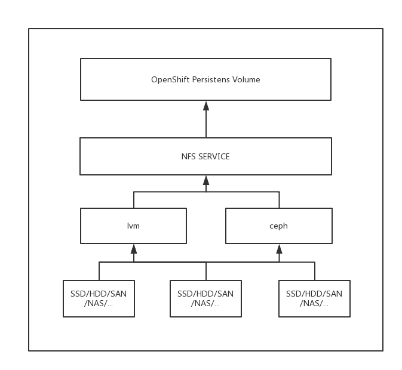
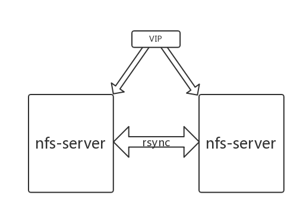

# NFS

随着Docker及Kubernetes技术发展的越来越成熟稳定，容器平台不仅仅局限于部署无状态应用，越来越多的有状态服务也可以在容器云上稳定地部署运行。openshift平台提供了静态持久化卷存储对象（persistent volume）以及持久化卷请求对象（persistent volume claim）

### 架构图



容器平台底层均通过nfs方式将持久化卷暴露并使用挂载到pod中。底层物理存储设备通过lvm管理或搭建ceph集群方式作为nfs服务的存储设备。最终上层调用主需要暴露nfs服务即可。这样做的优点如下：

* 共享型持久化数据卷，可以同时挂在多个pod中
* 支持多读多写
* 上层调用统一，不用关心底层存储实现方式
* 支持多种底层存储

## 容器平台相关调用

Convert2nfs是由Python编写创建持久化卷并暴露使用的程序。创建持久化数据卷时，通过调用convert2nfs程序在存储服务器创建持久化数据卷并暴露。容器平台创建持久化卷对于底层采用什么类型存储并不关心。目前convert2nfs集成两种底层存储，即lvm管理的卷以及ceph rbd。

### 运维及排查错误

1. 重新启动convert2nfs程序

   ```bash
   #登录到存储主机节点
   ssh {storage_host}

   #进入程序virtualenv虚拟环境
   source /opt/{virtualenv}/bin/activate

   #获取程序pid
   pid=`ps -ef | grep wsgi|grep -v grep|awk '{print $2}'`

   #杀掉程序进程
   kill -9 $pid

   #启动服务
   cd /opt/convert2nfs && uwsgi -d /var/log/convert2nfs.log --http-socket :8080 --venv /opt/{virtualenv} --pecan config.py
   ```

   * 若采用高可用架构，需要登录到两台存储服务器分别执行以上命令。
   * 启动中若出现“无法找到XXX模块”错误，切记进入到virtualenv环境后再执行命令

2. 查看程序日志
   * 程序运行日志路径为/var/log/convert2nfs.log
   * 程序错误日志路径为/var/log/convert2nfs\_error.log
3. 脚本授权

   查看/opt/convert2nfs/bin目录下脚本是否拥有执行权限，若没有执行如下命令

   ```bash
   chmod 755 -R /opt/convert2nfs/bin/
   ```

4. 服务健康检查

   访问[http://convert2nfs\_url](http://convert2nfs_url) 得到如下返回值表示服务启动正常

   ```javascript
   {"health": "ok"}
   ```

5. Openshift 平台pod日志中出现挂载卷失败

   ```bash
   #登录到存储服务器节点
   ssh {storage_host}

   #查看卷是否创建成功
   df -h | grep {volume_name}

   #若卷创建成功，查看是否nfs service将其暴露出去
   cat /etc/exports | grep {volume_name}

   #nfs暴露卷配置无异常，尝试手动挂载。
   #登录openshift 计算节点
   ssh {node_host}
   mount -t nfs nfs_ip:/nfs/{volume_name} /mnt

   #使用df命令查看是否成功将nfs卷挂载到本机目录
   df -h | grep {volume_name}
   ```

   挂载失败可能有如下几种原因：

   * Convert2nfs 创建持久化卷失败，具体查看convert2nfs程序及错误日志
   * 底层卷管理工具lvm创建lv失败，具体查看相关日志排查错误。若底层采用ceph rbd，请ceph运维人员查看ceph集群健康状况
   * 存储服务器防火墙未设定相关端口。需将111/2048/2049/20048-20050的tcp/udp端口允许计算节点访问

### 高可用



* 使用lvm管理每个用户创建的数据卷容量，在两台存储机会镜像创建相同的数据卷，所以请保证用于nfs的磁盘容量相同。
* 用户数据保存在/nfs/{namespace}{name}目录中，每个目录是一个lvm逻辑卷，容量由用户创建。
* 使用keepalived vip来保证nfs高可用，使用rsync从备机定时同步主机/nfs/目录下的数据以保证数据备份。
* 为了保证nfs-server完全无状态话，即切换过程中nfs客户端写入数据无卡顿，使用nfs v3以及udp协议作为挂载参数。

#### 主备切换

当主机down掉切换到备机时，因为上述高可用架构，可以做到无感知切换。

但是当主机修复，恢复之前主从结构时，需要在down掉的主节点上，首先确保keepalived服务停止，确保VIP不在主节点上；其次，在备机上启动rsyncd服务\(systemctl start rsyncd\)，之后查看主节点上/etc/crontab中的注释掉的rsync命令，手动运行以从从节点同步最新/nfs数据；同步完成后，启动keepalived确保VIP漂回主节点。

**注意：** 和harbor同理，为了保证服务的稳定和可控，服务于nfs的keepalived服务同样在配置文件中定了主备关系，而不是非抢占式的双备启动，因此当down掉的主节点在恢复后，需要确保VIP能回漂到主节点。  


