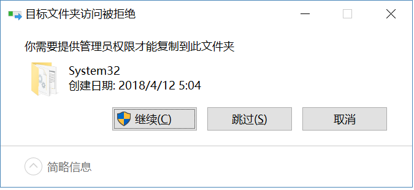

# OpenShiftCLI
# 简介 #
## 安装 ##

v3.9.0下载地址：https://github.com/openshift/origin/releases/tag/v3.9.0，根据客户端系统、OpenShift服务端版本选择对应的文件(client-tools)下载，请保持客户端文件和服务端版本一致；其他版本见：https://github.com/openshift/origin/tags

*备注:OpenShift集群中的node和master上可以直接使用*

### windows安装 ###

解压下载的安装文件
复制oc.exe到c:\Windows\system32\下,出现下图提示时点击继续

在命令行中就可以使用oc命令了

### linux安装 ###

解压下载的安装文件
复制oc到/usr/bin下，增加可执行权限

 `chmod +x /usr/bin/oc`

在命令行中就可以使用oc命令了
## 登录、登出 ##
登录进入OpenShift，所有操作都需要在有用户登录的前提下才能进行

### 登录 ###

**命令**: `oc login [url] [options]`

**选项**：

	 -p：密码
	
	 -u：用户名
	
	 --insecure-skip-tls： 跳过ssl证书验证

**示例**: 

`oc login https://os-console.xiaohehe.com:8443/ --insecure-skip-tls-verify -u admin -p passowrd`
### 登出 ###
直接输入 `oc logout` 就能退出登录
# 基本命令 #
## types ##
**用途**
列出了OpenShift中使用到的概念和类型，直接执行`oc types`就能获取到对应的概念和类型的解释、说明,下面的的大部分概念或者类型都会在后续的命令中使用到。

* Containers:
* Image:
* Pods [pod]:
* Labels:
* Volumes:
* Nodes [node]:
* Services [svc]:
* Routes [route]:
* Replication Controllers [rc]:
* Deployment Configuration [dc]:
* Build Configuration [bc]:
* Builds [build]:
* Image Streams and Image Stream Tags [is,istag]:
* Secrets [secret]:
* Projects [project]:

**使用方法**

直接执行`oc types`

## new-project  ##
**用途**

创建一个新的project，创建完成后会自动切换到该project下

**使用方法**

> oc new-project NAME [--display-name=DISPLAYNAME] [--description=DESCRIPTION]

**使用示例**
    
    
    oc new-project web-team-dev
    
    oc new-project web-team-dev --display-name="Web Team Development" --description="Development project for the web team."

## new-app ##
**用途**
指定源代码地址，模板或者镜像来创建一个新的应用

**使用方法**
> oc new-app (IMAGE | IMAGESTREAM | TEMPLATE | PATH | URL ...) [options]

**使用示例**

       

## status ##
**用途**

显示当前项目资源的概要：服务、dc、bc和pods，有配置问题的组件会单独显示出来

**使用方法**
> oc status [-o dot | -v ] [options]

**使用示例**   
    
      #显示当前项目的资源概要
      oc status
      
      # 以svg格式文件导出当前项目的资源概要
      oc status -o dot | dot -T svg -o project.svg
      
      # 显示当前项目的资源概要，包含有问题的部分
      oc status -v

## project ##
**用途**

切换到其他project，并把该project设置成当前默认的project

**使用方法**
> 
>   
>   oc project [NAME] [options]

**使用示例**     

    oc project myapp

## projects ##
**用途**

显示当前账号能访问的所有project，并标识当前默认project

**使用方法**

> oc projects [options]

**使用示例**

    oc projects
    

## explain ##
**用途**

资源文档描述，资源类型包含： pods (po), services (svc),
replicationcontrollers (rc), nodes (no), events (ev), componentstatuses (cs),
limitranges (limits), persistentvolumes (pv), persistentvolumeclaims (pvc),
resourcequotas (quota), namespaces (ns) or endpoints (ep).

**使用方法**
> oc explain RESOURCE [options]
> 

**使用示例**

      # 获取资源的文档：以yaml格式显示该资源的属性以及值
      oc explain pods
      
      # 显示某资源的具体的属性的相关信息
      oc explain pods.spec.containers

# 构建、部署命令 #
## rollout ##
**用途**

开始一次新的部署，查看部署历史或者状态，回退到之前的版本

**使用方法**

> oc rollout SUBCOMMAND [options]
> 
> SUBCOMMAND：
> 
>   cancel      取消正在进行的部署
>   
>   history     查看部署历史
>   
>   latest      从dc最新状态开始一次新的部署 
>   
>   pause       暂停指定的部署
>   
>   resume      重新开始暂停的部署
>   
>   retry       重试最近失败的部署
>   
>   status      查看部署状态
>   
>   undo        取消之前的部署

    

## rollback ##
**用途**

回退一个应用到之前的部署

**使用方法**

> oc rollback (DEPLOYMENTCONFIG | DEPLOYMENT) [options]

**使用示例**      

      # 回退到上一些成功部署
      oc rollback frontend
      
      # 验证是否能回退到第3个rc，但是不实际执行
      oc rollback frontend --to-version=3 --dry-run
      
      # 回退到rc：frontend-2
      oc rollback frontend-2
      
      # 查看最近部署更新的部分
      oc rollback frontend -o json

## new-build ##
**用途**
指定源代码进行一次构建：从代码库(仅支持git)下载代码，然后编译转换成可以运行的镜像。

**使用方法**
> 
> oc new-build (IMAGE | IMAGESTREAM | PATH | URL ...) [options]

**使用示例**   

      # 使用当前路径的git库和repo/langimage进行构建
      oc new-build . --docker-image=repo/langimage
      
      # 使用提供的镜像和源代码地址进行构建
      oc new-build
    openshift/nodejs-010-centos7~https://github.com/openshift/nodejs-ex.git
      
      # 使用远程源代码的beta2分支进行构建
      oc new-build https://github.com/openshift/ruby-hello-world#beta2
      
      # 通过-D传入Dockerfile内容进行构建
      oc new-build -D $'FROM centos:7\nRUN yum install -y httpd'
      
      # 使用远程代码库和自定义环境变量进行构建
      oc new-build https://github.com/openshift/ruby-hello-world -e
    RACK_ENV=development
      
      # 使用远程私有代码库和指定的secret进行构建
      oc new-build https://github.com/youruser/yourgitrepo
    --source-secret=yoursecret
     

## start-build ##

**用途**

启动一次构建： 由提供的bc名启动一次构建，或者使用--from-build复制别的bc进行一次构建

**使用方法**

> oc start-build (BUILDCONFIG | --from-build=BUILD) [options]
>
>

**使用示例**

      # 从bc "hello-world"启动构建
      oc start-build hello-world
      
      # 从上一次的构建 "hello-world-1"启动构建
      oc start-build --from-build=hello-world-1
            
      # 从bc “hello-world"开启一次构建，并输出日志一直到完成或失败
      oc start-build hello-world --follow
      
      # 从bc “hello-world”启动一次构建，一直等到构建完成或者失败，失败的时候非0退出
      oc start-build hello-world --wait

## cancel-build  ##

**用途**

取消运行中，等待，新的构建；请求取消跟实际终止构建中间有可能会有一定的延迟

**使用方法**

> oc cancel-build (BUILD | BUILDCONFIG) [options]

**使用示例**   

      # 取消指定名字的构建
      oc cancel-build ruby-build-2
      
      # 取消指定名字的构建并打印日志
      oc cancel-build ruby-build-2 --dump-logs
      
      # 重新开始构建
      oc cancel-build ruby-build-2 --restart
      
      # 取消多个构建
      oc cancel-build ruby-build-1 ruby-build-2 ruby-build-3

## import-image  ##

**用途**

导入一个镜像仓库中某个镜像的指定tag的元数据到istag中

**使用方法**

> oc import-image IMAGESTREAM[:TAG] [options]

**使用示例**

    oc import-image mystream

## tag  ##
**用途**
把存到的镜像标记到image streams中

**使用方法**

>  oc tag [--source=SOURCETYPE] SOURCE DEST [DEST ...] [options]

**使用示例**         

      # 把openshift/ruby:2.0标签成yourproject/ruby:tip
      oc tag openshift/ruby:2.0 yourproject/ruby:tip
      
      # 标签一个指定镜像
      oc tag
    openshift/ruby@sha256:6b646fa6bf5e5e4c7fa41056c27910e679c03ebe7f93e361e6515a9da7e258cc
    yourproject/ruby:tip
      
      # 标签一个外部镜像
      oc tag --source=docker docker.io/openshift/origin:latest yourproject/ruby:tip
      
      # 标签一个外部镜像并允许他从外部拉取
      oc tag --source=docker openshift/origin:latest yourproject/ruby:tip
    --reference-policy=local
      
      # 从image stream 删除一个指定的image stream tag.
      oc tag openshift/origin:latest -d

# 应用管理命令 #
## get ##

**用途**

用于获取资源信息

**使用方法**

    oc get

    -o yaml|wide
    	-o yaml 以yaml格式输出对应资源的信息
        -o wide 列表显示出更多的资源相关信息
    
    TYPE NAME|TYPE/NAME
         以类型 名字或者类型/名字表示资源
    
    [options]
    --all-namespaces：显示所有命名空间的对应资源
    --no-headers： 不输出列表头

**使用示例**        

	# 获取当前命名空间下所有的pod
    oc get pods

    #获取所有命名空间下的pod
    oc get pods --all-namespaces
    
	# 获取一个pod的简单信息
    oc get pod logging-fluentd-cjlgv
    
	#获取一个pod的相对详细的信息
    oc get pod logging-fluentd-cjlgv -o wide
    
	#获取一个pod的具体的yaml信息
    oc get pod logging-fluentd-cjlgv -o yaml
    
## describe ##
**用途**

显示特定资源的详细信息

**使用方法**

> oc describe (-f FILENAME | TYPE [NAME_PREFIX | -l label] | TYPE/NAM[options]

**使用示例**    
    
      # 显示镜像仓库ruby-22-centos7的详细信息
      oc describe imageRepository ruby-22-centos7
      
      # 显示bc ruby-sample-build的详细信息
      oc describe bc ruby-sample-build
    
## edit  ##
**用途**

使用系统默认的编辑器编辑指定的资源

**使用方法**

> oc edit (RESOURCE/NAME | -f FILENAME) [options]

**使用示例**        

      # Edit the service named 'docker-registry':
      oc edit svc/docker-registry
      
      # Edit the DeploymentConfig named 'my-deployment':
      oc edit dc/my-deployment
      
      # Use an alternative editor
      OC_EDITOR="nano" oc edit dc/my-deployment
      
      # Edit the service 'docker-registry' in JSON using the v1 API format:
      oc edit svc/docker-registry --output-version=v1 -o json

## set  ##
**用途**

**使用方法**

>   oc set COMMAND [options]
> 
> **rc dc:**
> 
>   env 更新pod的环境变量
>   
>   volumes 更新pod的卷
>   
>   probe   更新pod的探针
>   
>   deployment-hook 更新dc的出发钩子
>   
>   image   更新pod的镜像
> 
> **管理secret:**
> 
>   build-secret 更新bc的构建secret
> 
> **管理应用流:**
> 
>   image-lookup 修改部署应用时镜像的解析方式
>   
>   triggers 修改一个或多个应用的触发器
>   
>   build-hook  修改bc的构建触发钩子
> 
> **控制负载均衡:**
> 
>   route-backends  修改route后端的服务器

**使用示例**

      # 显示bc 'sample-build'定义的环境变量
      oc set env bc/sample-build --list
    
      # 给所有当前project下的pod添加环境变量ENV=prod
      oc set env rc --all ENV=prod
      
	  # 删除所有容器的环境变量
      oc set env dc --all --containers="c1" ENV-

           
## label  ##
**用途**

在一个或者多个资源上更新或者添加标签

**使用方法**

> oc label [--overwrite] (-f FILENAME | TYPE NAME) KEY_1=VAL_1 ... KEY_N=VAL_N
> [--resource-version=version] [options]

**使用示例**

    
      # 给pod foo添加标签unhealthy=true 
      oc label pods foo unhealthy=true
      
      # 给pod foo添加标签status=unhealthy，如果有该标签就覆盖
      oc label --overwrite pods foo status=unhealthy
      
      # 给当前命名空间下的所有pod添加标签status=unhealthy
      oc label pods --all status=unhealthy
      
      
      # 删除pod foo的标签 bar
      oc label pods foo bar-   

## annotate ##
**用途**

修改一个或者多个资源的注释

**使用方法**
> oc annotate [--overwrite] (-f FILENAME | TYPE NAME) KEY_1=VAL_1 ...
> KEY_N=VAL_N [--resource-version=version] [options]

**使用示例**    

      # 修改pod foo的注释 description='my fronted'，最次设置同一个注释时仅保留最后一个
      oc annotate pods foo description='my frontend'
    
      # 删除pod foo的注释description
      oc annotate pods foo description-

## expose ##
**用途**

由容器创建集群内部的service或者外部的route

**使用方法**

>  oc expose (-f FILENAME | TYPE NAME) [--port=port] [--protocol=TCP|UDP]
> [--target-port=number-or-name] [--name=name]
> [--external-ip=external-ip-of-service] [--type=type] [options]

**使用示例**

      # 创建service nginx的route，域名由route自动生成
      oc expose service nginx
      
      # 由service nginx创建一个指定lable和名字的route
      oc expose service nginx -l name=myroute --name=fromdowntown
      
      # 创建route并指定域名
      oc expose service nginx --hostname=www.example.com
      
      # 创建使用泛域名的route，需要给router增加环境变量ROUTER_ALLOW_WILDCARD_ROUTES=true
      oc expose service nginx --hostname=x.example.com --wildcard-policy=Subdomain
      
      # 指定端口由ruby-hello-world 创建service
      oc expose dc ruby-hello-world --port=8080
      
      # 创建指定路径的route
      oc expose service nginx --path=/nginx  

## delete  ##
**用途**

删除资源

**使用方法**

> oc delete ([-f FILENAME] | TYPE [(NAME | -l label | --all)]) [options]

**使用示例**        

      # 删除pod.json中的pod
      oc delete -f pod.json
      
      # 删除有标签name=myLabel的pod和service
      oc delete pods,services -l name=myLabel
      
      # 删除pod node-1-vsjnm.
      oc delete pod node-1-vsjnm
      
      # 删除所有有标签app=appName的资源
      oc delete all -l app=appName
      
      # 删除当前project下的所有pod
      oc delete pods --all

## scale ##
**用途**

修改dc、rc的副本数

**使用方法**
>   oc scale [--resource-version=version] [--current-replicas=count]
> --replicas=COUNT (-f FILENAME | TYPE NAME) [options]

**使用示例**       

      # 修改rc foo的副本数为3.
      oc scale --replicas=3 replicationcontrollers foo
      
      # 如果rc foo当前的副本数为2， 则增加到3
      oc scale --current-replicas=2 --replicas=3 replicationcontrollers foo
  

## autoscale ##
**用途**

自动伸缩dc，rc,根据一定条件在一定范围内伸缩dc，rc的数量

**使用方法**
> oc autoscale (-f FILENAME | TYPE NAME | TYPE/NAME) [--min=MINPODS]
> --max=MAXPODS [--cpu-percent=CPU] [flags] [options]

**使用示例**     

      #自动伸缩dc foo，数量在2-5之间，伸缩条件在cpu利用率达到一个默认值
      oc autoscale dc/foo --min=2 --max=10
      
      # #自动伸缩dc foo，数量在1-5之间，伸缩条件在cpu利用率达到80%
      oc autoscale rc/foo --max=5 --cpu-percent=80

# 故障排除调试命令 #
## logs ##
**用途**
显示某个资源的日志
支持的资源有builds，bc，dc，pods。如果pod有多个容器，用-c指定要查看日志的容器的名字。如果查看bc，dc的日志，可以用--version指定需要查看的版本。如果pod启动失败，可以用--previous查看上次尝试的日志

**使用方法**
>   oc logs [-f] [-p] (POD | TYPE/NAME) [-c CONTAINER] [options]

**使用示例**
    
      # 查看bc openldap最近一次构建的日志
      oc logs -f bc/openldap
      
      # 查看dc mysql最近一次构建的日志
      oc logs -f dc/mysql
      
      # 查看pod backend中的ruby-container中的日志
      oc logs -f pod/backend -c ruby-container

## rsh ##
**用途**

进入到容器内部的shell命令行

**使用方法**

> oc rsh [options] POD [COMMAND]

**使用示例**     
   
      # 打开pod 'foo'的shell命令行
      oc rsh foo
      
      # 在pod foo中运行命令'cat /etc/resolv.conf'
      oc rsh foo cat /etc/resolv.conf

## rsync ##
**用途**

在pod和本地之间同步文件
linux安装rsync
windows安装cwRsync：https://www.itefix.net/cwrsync

**使用方法**

> oc rsync SOURCE DESTINATION [options]

**使用示例**  
       
      # 同步本地目录到pod里的目录
      oc rsync ./local/dir/ POD:/remote/dir
      
      # 同步pod的目录到本地目录
      oc rsync POD:/remote/dir/ ./local/dir

## port-forward ##
**用途**
转发一个或多个端口到容器内部

**使用方法**
> oc port-forward POD [LOCAL_PORT:]REMOTE_PORT [...[LOCAL_PORT_N:]REMOTE_PORT_N]
> [options]

**使用示例**  

      
      # 本地8888端口映射到容器mypod的5000端口
      oc port-forward mypod 8888:5000
      
      # 本地随机端口映射到容器mypod的5000端口
      oc port-forward mypod :5000
      
      # 本地随机端口映射到pod内部端口5000
      oc port-forward mypod 0:5000

## debug ##
**用途**
启动命令行调试一个运行中的应用，主要用于不能执行exec，rsh的情况下

**使用方法**

> oc debug RESOURCE/NAME [ENV1=VAL1 ...] [-c CONTAINER] [options] [-- COMMAND]

**使用示例**      
      # 调试当前运行的dc
      oc debug dc/test
      
      # 测试dc/test以非root用户启动
      oc debug dc/test --as-user=1000000
      
      # 调试运行失败，运行env命令
      oc debug dc/test -c second -- /bin/env
      
## exec ##
**用途**

在容器中运行一个命令

**使用方法**

> oc exec [options] POD [-c CONTAINER] -- COMMAND [args...]

**使用示例**        
      # 在pod mypod的容器ruby-container中执行data并返回结果
      oc exec mypod -c ruby-container date
      
      # 启动到容器的交互式命令，效果等同于oc rsh
      oc exec mypod -c ruby-container -i -t -- bash -il

## cp ##
**用途**

用于在容器和本地之间复制文件

**备注： 需要容器内有tar命令，如果没有此命令失效**

**使用方法**
> oc cp <file-spec-src> <file-spec-dest> [options]

**使用示例**        
 
      # 复制本地的/tmp/foo_dir到容器的/tmp/bar_dir
      oc cp /tmp/foo_dir <some-pod>:/tmp/bar_dir
      
      # 复制本地/tmp/foo到制定命名空间下的pod的/tmp/bar
      oc cp /tmp/foo <some-namespace>/<some-pod>:/tmp/bar
      
      # 复制指定命名空间的pod的/tmp/foo到本地的/tmp/bar
      oc cp <some-namespace>/<some-pod>:/tmp/foo /tmp/bar

# 高级命令 #
## adm ##
**用途**
**使用方法**
**使用示例**        
Tools for managing a cluster
## create ##
**用途**

使用文件名或者标准输入创建资源，支持json，yaml格式

**使用方法**
> oc create -f FILENAME [options]

**使用示例**      

      # 使用pod.json创建该文件中的内容.
      oc create -f pod.json
      
      # 使用pod.json创建该文件中的内容.
      cat pod.json | oc create -f -

## replace ##
**用途**

使用yaml或者json文件中的配置替换当前资源的内容

**使用方法**

> oc replace -f FILENAME [options]

**使用示例**    

      # 使用pod.json中的内容替换指定的pod.
      oc replace -f pod.json
      
      # 使用标准输入中的pod.json替换容器.
      cat pod.json | oc replace -f -
      
      # 强制替换，删除当前的pod并创建新的内容
      oc replace --force -f pod.json

## apply ##
**用途**
**使用方法**
**使用示例**       
Apply a configuration to a resource by filename or stdin
## patch ##
**用途**

更新一个资源的一个或者多个字段

**使用方法**

> oc patch (-f FILENAME | TYPE NAME) -p PATCH [options]

**使用示例**
       
      # 更新node k8s-node-1 的spec下unschedulable,设置node k8s-node-1为不可调度
      oc patch node k8s-node-1 -p '{"spec":{"unschedulable":true}}'
## process ##
**用途**

转换模板中定义的内容为资源列表

**使用方法**

> oc process (TEMPLATE | -f FILENAME) [-p=KEY=VALUE] [options]

**使用示例**      
    
     # 转换template.json中的资源并创建
      oc process -f template.json | oc create -f -
      
      # 转换template.json中资源并以yaml的格式输出
      oc process -f template.json --local -o yaml
      
      # 转换模板foo为定义的资源列表
      oc process foo
      
      # 转换模板foo中的资源列表并重新设置PARM1和PARM2的值
      oc process foo PARM1=VALUE1 PARM2=VALUE2
      
    
## export ##
**用途**
**使用方法**
**使用示例**        
Export resources so they can be used elsewhere
## extract ##
**用途**
**使用方法**
**使用示例**        
Extract secrets or config maps to disk
## idle ##
**用途**
**使用方法**
**使用示例**       
Idle scalable resources
## observe ##
**用途**
**使用方法**
**使用示例**      
Observe changes to resources and react to them (experimental)
## policy ##
**用途**
**使用方法**
**使用示例**     
Manage authorization policy
## auth ##
**用途**
**使用方法**
**使用示例**         
Inspect authorization
## convert ##
**用途**
**使用方法**
**使用示例**       
Convert config files between different API versions
## import ##
**用途**
**使用方法**
**使用示例**        
Commands that import applications
## image ##
**用途**
**使用方法**
**使用示例**        
Useful commands for managing images
