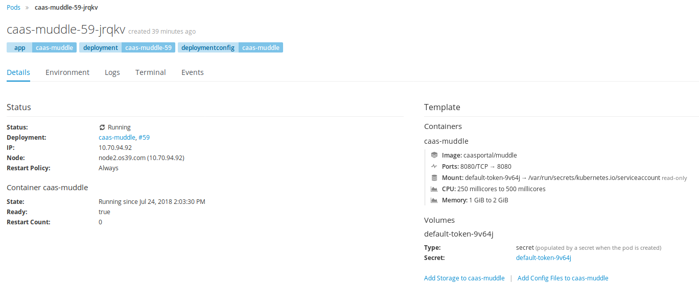

# OpenShift Web Console

## 登录

OpenShift Web Console域名在CaaS平台部署时可以商定，因此如果不确定域名是什么，可以询问平台的部署实施工程师。

在浏览器中，需要以 https://域名:8443的方式登录。

## 创建项目

点击屏幕右侧的【Create Project】就可以创建项目，创建时需要填入Name, display name（建议和name一致\) 以及 description。

## 管理项目

### 查看所有项目列表

创建好的项目，可以在右侧的项目列表里显示。但默认只会显示最新创建或更新的五个项目，当需要查看所有项目列表时，点击上图中的【View All】。点击后会进入项目列表展示页面，如下图

在该页面中，在上方的输入框中可以输入项目名称进行搜索。

### 项目基本维护

在上图中，点击项目右侧的竖排三个点，可以对项目进行基本的维护操作，如编辑项目中的用户成员角色信息，编辑项目的描述，以及删除项目。

